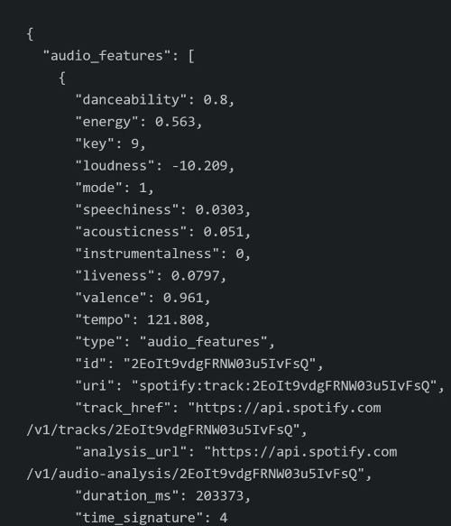
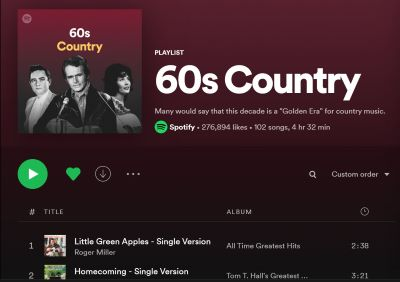
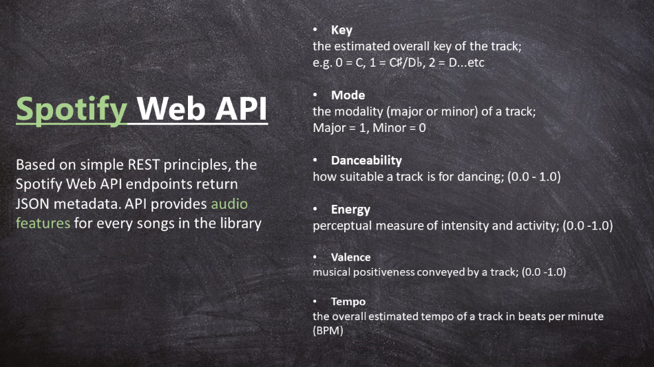

# Visualizing Country Music Using Python, Power BI, and the Spotify API
This project aims to  identify changes withhin the country music genre across decades through the utillizaiton of Spotify's API.

Tools and Procedures:

* Python (Pandas, Matplotlib, Spotipy library)

* Power BI

* Excel

* PowerPoint

* Spotify API

* API Querying

* Data Cleaning, Exploatarion, Visualization, and Analysis

## "Country music is gone - and it's not coming back."- Alan Jackson

As someone who is relatively ignorant of country music and its history, I have many times been exposed to the notion that country music has evolved into something very different, if not contrary, from what it was during its "Golden Era".
[^1]
While some people making this observation are simply concerned about the incorporation of modern digital elements, I think that many people view country music's place in today's musical landscape as being very different from where it was during the mid-twentieth century.
A common complaint involves increasing overlap between it and pop music, even incorporating elements from rap and hip hop as well.  This growing trend is in opposition to Golden Era country music, where its place in the musical landscape was (presumably) more carved out and distinct.
While I have no wish to judge whether I agree with this sentiment, nor voice preference of one form of music over another, I thought that it would be interesting to investigate this claim visually using data analysis techniques.

 

# Table of Contents
1. [Data Questions](#data-questions)
2. [Methodology](#methodology)
3. [Data Sources](#data-sources)
4. [Auth Cleaning and Exporting](#auth-cleaning-and-exporting)

## Data Questions
1. How has country music changed musically from decade to decade since the 1960's?
2. How has pop music changed musically from decade to decade since the 1960's?
3. How has pop and country music's trajectories correlated/diverted?

## Methodology 
In determining the best way of investigating the changes in country music, it's best to look at the source itself, the music of course! 
Whereas before it may have been difficult to objectively get qualitative attributes [^2]of songs besides length and tempo, today we have algorithms that can determine qualities of a song through processes such as machine learning.
One of the most phemonenol features that Spotify provides is their end-of-year "Wrapped" playlists, which utillizes these types of algorithms in no small part to make conclusions about their user's listening habits.
Does this user prefer happier up-tempo music, or do they prefer slower more somber music?  Based on how their preferred music rates in terms of valence[^3], energy, etc, Spotify can use that data to draw conclusions.
Spotify provides access to this information for their entire catalogue through their API, which we can use to get all of the attributes we want for our songs.  
Below is an example of the results of an API query to get the audio features for the song "Achy Breaky Heart" by Billy Ray Cyrus:
 

 
Each variable is listed with its rating, and a collection of these queries from releases of a particular time/genre can aid in making inferences about musical norms. 
As stated, this projects aims to collect country music and its attributes into a useable format in order to determine changes in musical preferences across decades.
In order to do so, lists of songs that are indicative of the music that was going on at the time is integral to this project.
 

## Data Sources
The next step is to determine how to get the music to search for in the API. 
Spotify's API allows for searching for tracks within a playlist, and the most straghtforward way I found to get music was by utillizing both pre-existing and self-created playlists.
Below is an example of one of the playlists I used to get a list of songs emblematic of country music in the 1960's[^4].
 

  
I primarily relied on Spotify-created playlists for country music, and for pop I utillized [davesmusicdatabase.blogspot.com](https://davesmusicdatabase.blogspot.com/p/best-of-lists.html#songs-era), which generates lists of the most popular songs of each decade utillizing sales figures, chart data, radio airplay, and streaming figures.
 
## Auth Cleaning and Exporting
My preferred method of querying in the API was by using the [Spotipy]() library for python.

[^1]: "Golden Era" generally referring the period bewteen the 50's and 60's when the likes of Johnny Cash, Patsy Cline, and Merle Haggard dominated the charts
[^2]: A qualitative attribute in this case is a measure of the pressence of a certain element in a song, such as its perceived acousticness, energy, etc.
[^3]: The perceived positivity/negativity of a song.
[^4]: Obviously people's opinions on what the defining music of a decade is, and it was a challenge to find a process that worked with a sense of objectivity.  
For country music, Spotify has devoted playlists for each decade, which I determined effective in depicting the musical norms of the time.  