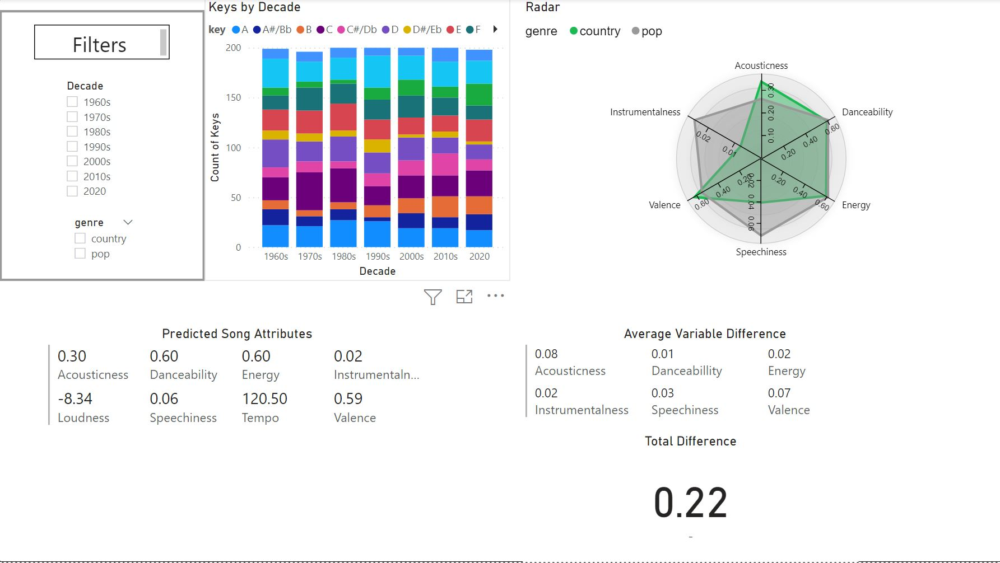
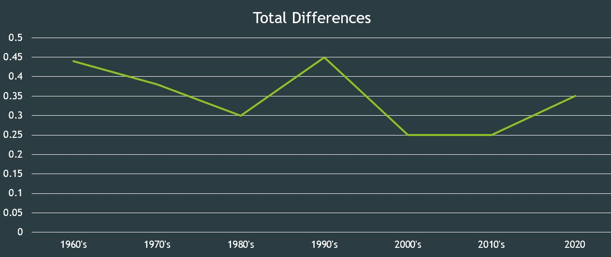

# Visualizing Country Music Using Python, Power BI, and the Spotify API
This project aims to  identify changes withhin the country music genre across decades through the utillizaiton of Spotify's API.

Tools and Procedures:

* Python (Pandas, Matplotlib, Seaborn, Spotipy library)

* Power BI (DAX)

* Excel

* PowerPoint

* Spotify API

* API Querying

* Data Cleaning, Exploatarion, Visualization, and Analysis

## "Country music is gone - and it's not coming back."- Alan Jackson

As someone who is relatively ignorant of country music and its history, I have many times been exposed to the notion that country music has evolved into something very different, if not contrary, from what it was during its "Golden Era".
[^1]
While some people making this observation are simply concerned about the incorporation of digital elements into the genre, I think that many people view country music's place in today's musical landscape as being very different from where it was during the mid-twentieth century.
A common complaint involves an increasing overlap between it and pop music, even incorporating elements from rap and hip hop as well.  This growing trend is in opposition to Golden Era country music, where its place in the musical landscape was (presumably) more carved out and distinct.
While I have no wish to judge whether I agree with this sentiment, nor voice preference of one form of music over another, I thought that it would be interesting to investigate this claim visually using data analysis techniques.

 

# Table of Contents
1. [Data Questions](#data-questions)
2. [Methodology](#methodology)
3. [Data Sources](#data-sources)
4. [Cleaning and Exporting](#cleaning-and-exporting)
5. [Analysis](#analysis)
6. [Conclusion](#conclusion)
7. [Sources](#sources)
## Data Questions
1. How has country music changed musically from decade to decade since the 1960's?
2. How have pop and country music's trajectories correlated/diverted?

## Methodology
In determining the best way of investigating the changes in country music, it's best to look at the source itself, the music of course!
Whereas before it may have been difficult to objectively get qualitative attributes of songs [^2], today there are algorithms that can determine qualities of a song through processes such as machine learning.
One of the most phemonenol features that Spotify provides is their end-of-year "Wrapped" playlists, which utillizes these types of algorithms in no small part to make conclusions about their user's listening habits.
Does this user prefer happier up-tempo music, or do they prefer slower more somber music?  Based on how their preferred music rates in terms of valence[^3], energy, etc, Spotify can use that data to draw conclusions.
Spotify provides access to this information for their entire catalogue through their API, which I queried using the Spotipy Python library to get data for country music songs.  
Below is an example of the results of an API query to get the audio features for the song "Achy Breaky Heart" by Billy Ray Cyrus:
 

 
Each variable is listed with its rating, and a collection of these queries of releases from a particular time/genre can aid in making inferences about musical norms.
As stated, this project aims to collect country music and its attributes into a useable format in order to determine changes in musical preferences across decades.
In order to do so, lists of songs indicative of each decade is integral to the success of this project.
 
## Data Sources
The next step is to determine how to get the music to search for in the API.
Spotify's API allows for searching for tracks within a playlist, and the most straghtforward way I found to get music was by utillizing both pre-existing and self-created playlists.
Below is an example of one of the playlists I used to get a list of songs emblematic of country music in the 1960's[^4].
 

 
I primarily relied on Spotify-created playlists for country music, and for pop I inputted data from [davesmusicdatabase.blogspot.com](https://davesmusicdatabase.blogspot.com/p/best-of-lists.html#songs-era) into Spotify playlists[^5] .
I inputted data from the billboard hot 100 year-end charts for contemporary pop and country as well.  
 
## Cleaning and Exporting
My preferred method of querying in the API was by using the [Spotipy](https://spotipy.readthedocs.io/en/2.19.0/) library for python.
The process was to get the data from JSON format into a Pandas DataFrame, and then exporting in csv format for dashboarding.  

 
## Analysis
I've found boxplots to be incredibly useful in visualizing changes across decades.  In this case, they give a high-level understanding of the distribution of the data for each variable, and when plotted by decade, paint an informative picture of how they change over time.
We can see, for instance, that acousticness overall has become predictably less and less prominant over time.  Due to the adoption of digital instruments and recording processes as opposed to analog, it is no surprise to see this taking place.  This outlines an effective way of interpretting this data, which is to compare what is being displayed to what we know about the progression of music and the adoption of technology over the last several decades.

[^6]
 

Comparing the genres using the boxplots shows that many musical tendencies overlap across the decades, but also there are notable differences as well.  Acousticness, loudness, tempo, valence, and length appear to behave very similarly over time, whereas danceabillity, energy, and speechiness seem to have the greatest discrepencies.
 
 
Lastly, the other Power BI dashboard allows for the data to be summarized in other ways.  For those musically-inclined, the stacked bar chart gives a colorful picture of how music keys are distributed throughout the dataset, and by using the genre filter, can be used to see which keys are more prevalent in both genres across the decades.  The Predicted Song Attriutes aggregates each variable around the mean to show the most typical song based on the year and genre.  The other visuals serve to depict how pop and country overlap, based on the metrics chosen for the analysis.  The radar chart shows how each variable is distributed across multiple axes with both genres overlayed on top of one another.  Finally, the Average Variable Difference visual takes the absolute number of the difference between the pop and country versions of each variable.  The higher the number is, the greater the discrepency between pop and country for that metric.  Beneath is the sum of each variable from the previous visual shown as Total Difference.  

 
 
## Conclusion
 
To reiterate, much of the analysis involves comparing what is being depicted through the visuals with what one would expect to see based on prior music knowledge.  Although my country music know-how is limited, I did expect to see a lessening of acoustic elements as the timeline neared the new millenium due to increasing reliance on digital music elements.  Someone with more extensive country music knowledge would probably know the "why" of some of the behavior being captured through these visuals.  Some things I found interesting are as follows:

1. The danceabillity metric behaved very differently between country and pop, with it being more concentrated around the median with a gradual tapering off for country and more variabillity with gradual increasing in prevalence for pop.
2. Pop music rewarded highly energetic music with strong concentration around the mean for the energy variable before it becomes less prominent as the new millennium progresses. Country music suddenly becomes energetic in the 90's and remains at a relatively consistent level.
3. The greatest musical difference between pop and country found across all variables was for valence during the 90's.
 

 
Line chart showing results of Total Difference visual for each decade
 
 
As for the sentiment that country and pop are slowly fusing over time, I believe the line chart above provides an interesting perspective on that issue.  The value for each decade corresponds to the difference between the average of all variables that are on a 0.0 - 1.0 scale for country and pop [^6].  The higher the value, the greater the musical difference between country and pop, at least with regards to the variables being examined.  With that in mind, the 1960's and 1990's appear to be the periods where country was the most distinct from pop, and the 2000's and 2010's being the most similar.  Contemporary music, interestingly, lies in the middle with a .35 similarity score (for lack of a better word), meaning that modern country music, while not the most distinct from popular music, is also not the most heavily correlated.  The last decade where there was a sharp increase in the overall "distinctiveness" of country was followed by a period where it and pop music were the most interconnected.  Will the future of country music revisit past trends and become even more ubiquitous with pop music, or will it continue in this upward trend towards distinctiveness and retain its individuality as it did before the new millenium?
 
## Sources
 
The following resources have been incredibly valuable in this project:
 

[https://wallpaperaccess.com/full/1373271.jpg](https://wallpaperaccess.com/full/1373271.jpg)
 

[https://towardsdatascience.com/visualizing-spotify-songs-with-python-an-exploratory-data-analysis-fc3fae3c2c09](https://towardsdatascience.com/visualizing-spotify-songs-with-python-an-exploratory-data-analysis-fc3fae3c2c09)
 

[https://developer.spotify.com/](https://developer.spotify.com/)
 

[https://spotipy.readthedocs.io/en/2.19.0/](https://spotipy.readthedocs.io/en/2.19.0/)
 

[https://www.billboard.com/charts/year-end/2020/hot-country-songs/](https://www.billboard.com/charts/year-end/2020/hot-country-songs/)
 

[https://medium.com/web-mining-is688-spring-2021/preliminary-data-analysis-on-spotify-data-using-api-a84bb0aae00c](https://medium.com/web-mining-is688-spring-2021/preliminary-data-analysis-on-spotify-data-using-api-a84bb0aae00c)
 
 
Footnotes
 
[^1]: "Golden Era" generally referring the period bewteen the 50's and 60's when the likes of Johnny Cash, Patsy Cline, and Merle Haggard dominated the charts
[^2]: A qualitative attribute in this case is a measure of the pressence of a certain element in a song, such as its perceived acousticness, energy, etc.
[^3]: The perceived positivity/negativity of a song.
[^4]: Obviously people's opinions on what the defining music of a decade is, and it was a challenge to find a process that worked with a sense of objectivity.  
For country music, Spotify has devoted playlists for each decade, which I determined effective in depicting the musical norms of the time.  
[^5]: An online database that creates lists of the most popular songs for each decade utillizing sales figures, chart data, radio airplay, and streaming figures.
[^6]: Acoustincess, Danceabillity, Energy, Instrumentalness, Speechiness, Valence

